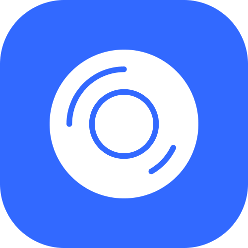

  </a>

<h1 align="center">
  <b>Sentilens</b>
</h1>

**Sentilens** - это мобильное приложение для управления заметками, которое поможет вам оставаться на позитивной волне. Создавайте, редактируйте, сохраняйте и удаляйте заметки. Главной особенностью Sentilens является его способность анализировать эмоциональную окраску текста в ваших заметках. После анализа, Sentilens предложит вам способы улучшения вашего настроения на основе обнаруженных эмоций в заметке. Например, если вы написали заметку, содержащую грустные эмоции, приложение может предложить послушать музыку, почитать что-то интересное или заняться любимым делом.

---

Данный репозиторий содержит приложение, которое реализовано с использованием [**Compose Multiplatform Framework**](https://github.com/JetBrains/compose-multiplatform/#readme). Это позволяет разрабатывать приложения для множества платформ, используя общий код на языке Kotlin. Это означает, что в проекте используется общий код для Android, Desktop, Web и iOS, что упрощает и ускоряет процесс разработки.

## **Библиотеки**

- [*Kotlin Mutliplatform*](https://kotlinlang.org/lp/multiplatform/)
- [Compose Multiplatform](https://www.jetbrains.com/lp/compose-multiplatform/)
- [Ktor Client](https://ktor.io/)
- [Realm](https://realm.io/)
- [Voyager](https://voyager.adriel.cafe/)
- [Koin](https://insert-koin.io/)

## Серверная часть

[Подробнее о сервеной части приложения](https://github.com/MelDxKviel/SentilensBackend/tree/master)

## Авторы

- [**MaximDvinov**](https://github.com/MaximDvinov) - клиентская часть
- [**MelDxKviel**](https://github.com/MelDxKviel) - серверная часть
